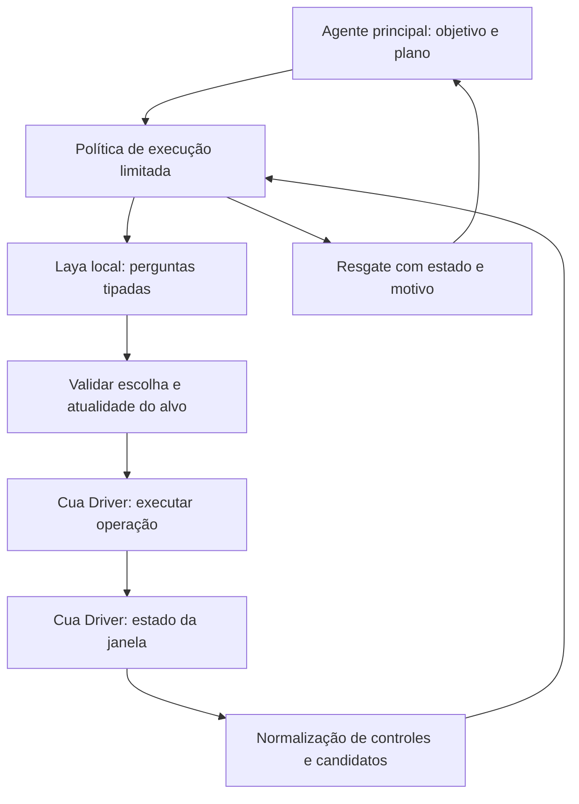

# Investigação: decisões Laya no Cua Driver

Status: registro histórico da investigação que antecedeu a implementação autorizada. Ver [V1](2026-09-29-laya-computer-v1.md) e [validação](../reports/laya-computer-v1-validation.md) para o estado atual. A tentativa de inspecionar Photos pelo driver parou em `permissions_pending`, sem iniciar a ação solicitada.

## Objetivo

Investigar o reaproveitamento das decisões locais do Laya para computer use. O usuário definiu como objetivo principal economizar tokens do modelo forte: esse modelo faz o raciocínio e fornece o plano; decisões intermediárias podem ser delegadas ao Laya ou a modelos textuais menores; Cua Driver e outras ferramentas observam e executam. Reduzir tempo total é desejável, mas o critério principal declarado é economia de tokens do modelo forte.

Ganho, custo por tarefa e confiabilidade no desktop: **não medidos**. O usuário aceita maior lentidão se houver sucesso; retornos frequentes ao modelo forte e seu consumo de tokens caracterizam fracasso da proposta.

## Direção confirmada pelo usuário

- Planejamento e raciocínio sobre a tarefa permanecem no modelo forte.
- O objetivo da delegação é tornar viável o uso de modelos grandes, poupando sua participação nas decisões operacionais necessárias para cumprir o plano.
- Laya é o decisor local da V1. Modelos textuais menores continuam como direção futura; a recuperação da V1 usa o modelo forte, sem exigir um modelo local adicional.
- Cua Driver é um observador/executor; outras ferramentas podem cumprir esses papéis. A arquitetura desejada não se limita conceitualmente a uma ferramenta de desktop.
- Benchmarks Jev servem de referência inicial, pela semelhança funcional com Laya. Essa base orienta hipóteses e cenários; não se atribuem automaticamente seus resultados numéricos ao novo fluxo.

- Delegar a etapa verificável mais longa possível: o modelo forte deve antecipar o plano inteiro ou suas etapas, permitindo avançar localmente entre etapas já previstas. A fronteira de uma etapa não implica uma nova chamada ao planejador.
- Primeiro aplicativo de avaliação: Photos do macOS. O usuário refinou o piloto para encontrar a foto mais antiga possível pela ordenação, sem exigir um intervalo de datas previamente escolhido.
- Maior lentidão é aceitável quando a tarefa conclui com sucesso. Resgates frequentes ao modelo forte são fracasso, mesmo que eventualmente levem à conclusão.
- Recuperação da V1: o modelo forte resolve o problema e adapta o mínimo viável do plano. Pode usar um subagente para resolver o obstáculo; isso é opcional, sem requisito de modelo local. Todos esses tokens entram na medição.

- Implementação em um novo MCP neste catálogo, conforme escolha explícita do usuário. Ver [ADR 0001](../adr/0001-separate-desktop-decision-mcp.md).

O contrato detalhado está consolidado para revisão na proposta V1.

## Evidência local atual

O diretório `/Users/matheusborges/github/laya-ultrafast` aponta para `MathBorgess/ultrafast-browser-mcp`; HEAD observado: `094f9aa1a6ae2409ba9345b9afffaf80707250ef`. O nome da pasta não identifica mais o nome do remoto.

- `laya_ultrafast/laya.py:1–7,18,41–49`: o código descreve um encoder de decisões tipadas de 421M; `laya-mlx` é a biblioteca de execução, e o checkpoint padrão é `aac6fef/laya-typed-decisions-mlx`. Carregamento e aquecimento ocorrem uma vez por processo.
- `laya_ultrafast/laya.py:250–261`: `system_one(state, questions)` responde perguntas delimitadas; o código valida as escolhas. Não é uma interface de interpretação de screenshots.
- `laya_ultrafast/model.py:76–91`: valida IDs, probabilidades e confiança. Validade estrutural não demonstra acerto semântico nem calibração da confiança no desktop.
- `laya_ultrafast/mcp.py:7–8,42–114`: o agente chamador fornece objetivo e plano ao `laya_run_task`, incluindo requisitos e condição de conclusão. Portanto, o planejamento já pode ficar no cliente MCP.
- `laya_ultrafast/browser.py:9–29,96–159`: Browser Harness fornece daemon/CDP; o wrapper mantém sessão, observa o DOM, verifica atualidade do alvo e executa ações. É esse contrato de observação/execução que precisa de equivalente desktop.
- `docs/performance.md`: resultados históricos usam TypeSafe/Jev e Mercury e excluem etapas como configuração e navegação inicial. Não são um benchmark da integração Laya local + Cua Driver.

## Hipótese de integração

### Contrato do Cua Driver

CLI encontrado em `/Users/matheusborges/.local/bin/cua-driver`. `--help` identificou versão **0.23.2**. Inicialmente `status` informou daemon inativo. Após abrir `CuaDriver.app` via LaunchServices, `status` informou daemon ativo em modo standard, mas a consulta de permissões permaneceu `unknown`. `call launch_app` para `com.apple.Photos` terminou com código 75 e `permissions_pending`: Acessibilidade ou Gravação de Tela pendente; nenhuma ação iniciada. A cobertura real da interface do Photos permanece não verificada. Não foram alteradas permissões nem usados modos de bypass.

Os schemas locais de `describe` confirmaram observação sem screenshot (`include_screenshot:false`), elementos estruturados e ações com `element_token` ou `element_index` acompanhado de `snapshot_id`. `verify_state` aceita de 1 a 8 predicados AND, retorna `satisfied`/`unsatisfied`/`unknown` e não suporta comprovar ausência por `exists:false`. A prosa abreviada sobre índices não substitui os requisitos do schema de ação. Esses fatos foram verificados no contrato instalado, sem executar ações de interface.

As referências abaixo complementam a inspeção local com documentação oficial em `main`; recursos não conferidos no schema instalado continuam sujeitos a diferenças de versão.

- [README oficial](https://github.com/trycua/cua/blob/main/libs/cua-driver/README.md): CLI, MCP e SDKs Python/TypeScript expõem o driver; é possível conectar a um daemon existente.
- [Workflow](https://github.com/trycua/cua/blob/main/libs/cua-driver/rust/Skills/cua-driver/WORKFLOW.md): `list_apps` → `list_windows` → `get_window_state` fornece `structuredContent.elements`, com tokens opacos, papel, rótulo, valor e ações. Observação pode dispensar screenshot. Truncamento da árvore não demonstra ausência de controle.
- `click`/`type_text` usam `element_token` e alvo de janela; `set_value` tem contrato próprio. Não inferir suporte à operação apenas pelo papel do controle.
- Uma nova observação da mesma janela invalida tokens anteriores, inclusive quando feita por outro agente. Proposta: serializar observar → decidir → agir por janela e preservar identidade da observação no executor.
- [Contrato SDK](https://github.com/trycua/cua/blob/main/libs/cua-driver/contract/README.md): `verify_state` verifica predicados com resultados `satisfied`, `unsatisfied` ou `unknown`. Confirmação de efeito da ação não prova por si só a conclusão semântica da tarefa.
- [Limites macOS](https://github.com/trycua/cua/blob/main/libs/cua-driver/rust/Skills/cua-driver/MACOS.md): acessibilidade pode estar vazia ou incorreta; Electron/Catalyst e superfícies canvas exigem atenção à diferença entre valor exposto e resultado renderizado. Laya textual não fornece percepção visual nem OCR. Suporte a interação em segundo plano depende do app e da operação.

### Fluxo proposto

Esse fluxo é uma proposta. Reutilizar a chamada ao modelo é diferente de reutilizar a política web: regras atuais sobre formulários, sugestões e submissão não cobrem automaticamente menus, janelas, arraste ou aplicativos gráficos.

Separar a implementação da política, a adaptação do driver e a exposição via MCP parece uma direção útil a testar. Um novo MCP e um novo backend não são alternativas excludentes: MCP define a interface do cliente; o backend define como observar e executar. A localização do código permanece aberta.

## O que medir antes de afirmar ganho

Comparar tarefas equivalentes com resultado verificado independentemente, contabilizando tentativas malsucedidas. Registrar separadamente carregamento frio e modelo aquecido; tempo de observação, inferência, execução e verificação; chamadas e custo remoto informado pelo provedor; tokens obsoletos e resgates. Não converter ausência de cobrança de API local em custo total zero.

A comparação principal proposta é entre o modelo forte conduzindo cada interação e o modelo forte fornecendo um plano para execução delegada, usando as mesmas tarefas e ferramentas. Somar tokens do planejamento, retornos ao modelo forte, recuperação de falhas e verificação final. Separar entrada, saída e cache quando disponíveis; medir modelos menores à parte. Reportar taxa de conclusão ao lado da economia para evitar contabilizar tarefas abandonadas como ganhos.

Hipótese a validar: manter o ciclo observar → decidir → executar fora do contexto do modelo forte por várias ações pode economizar mais tokens do que consultar Laya e devolver cada passo ao planejador. Uma resposta curta do decisor não basta se o agente principal continuar recebendo toda a observação e conduzindo cada interação.

Proposta de critério para o primeiro teste, ainda não confirmada: um planejamento inicial; nenhuma chamada intermediária ao modelo forte no percurso previsto; resultado sustentado por evidência observável; retorno final compacto. Registrar uma tarefa recuperada pelo modelo forte como resultado separado, sem apresentá-la como sucesso autônomo. O orçamento do plano inicial também entra na conta: antecipar contingências ilimitadas pode consumir mais tokens do que economiza.

## Execução prolongada: proposta de contrato

O controlador local guarda a posição no plano, aplica condições de avanço e fornece ao Laya perguntas delimitadas sobre a observação atual. O plano deve expressar alvos semânticos e resultados desejados; tokens de elementos só podem ser vinculados após observar a interface correspondente. Não prever tokens ou coordenadas de estados futuros.

Proposta: antecipar etapas e alternativas comuns no plano inicial, executar e verificar cada etapa localmente, seguindo para a próxima sem passar pelo modelo forte. A transição depende do resultado observado, não apenas do envio bem-sucedido de uma ação. Estados não previstos que impeçam progresso acionam o resgate pelo modelo forte, conforme a escolha do usuário para a V1. Laya não se torna um planejador geral apenas porque o plano contém mais etapas.

### Resgate mínimo na V1

Decisão confirmada: recorrer ao modelo forte para resolver o obstáculo e modificar o mínimo viável do plano. Pode delegar a resolução a um subagente; não é obrigatório nem implica modelo local.

Contrato proposto para revisão: devolver ao agente chamador a etapa atual, o motivo da interrupção, uma observação compacta relevante, ações recentes e seus efeitos conhecidos e o progresso já verificado. A instrução de resgate pede diagnóstico, intervenção necessária e alteração apenas do trecho afetado do plano, preservando objetivo e restrições. A versão do plano e o estado de retomada permitem identificar o que mudou. Depois de uma intervenção, observar novamente antes de executar; nunca reutilizar tokens anteriores ou repetir uma mutação de resultado incerto.

O agente chamador pode executar uma correção pontual ou usar um subagente, mas a execução local deve ficar suspensa durante essa intervenção para não competir pela mesma janela. Retomar pelo primeiro ponto ainda não comprovado, revalidando precondições afetadas pela correção. Esta mecânica detalhada é proposta, ainda não implementação.

Resultados devem distinguir conclusão sem resgate, conclusão com resgate e tarefa não concluída. O resgate é permitido; sua frequência e os tokens adicionais determinam se a proposta está atingindo o objetivo econômico. O limite operacional de resgates permanece a definir no contrato final.

## Árvore de decisões aberta

Rodadas 1–3: divisão de papéis, prioridade de economia de tokens, execução local prolongada entre etapas previstas e Photos com filtro de data antiga como piloto confirmados. Lentidão é tolerável; dependência frequente do modelo forte não é. Resgate da V1 é pelo modelo forte com reparo mínimo do plano e possibilidade de subagente.

Rodada 4: buscar a foto mais antiga por ordenação e construir um novo MCP no catálogo. Decisão registrada no ADR 0001.

Contrato completo proposto: [Laya Computer V1](2026-09-29-laya-computer-v1.md), incluindo plano, ferramentas, resultados, limites iniciais, resgate e isolamento. Próximo passo de design: confirmar entendimento desse contrato antes de implementar, conforme a skill de entrevista solicitada.

Pendência de ambiente: o driver precisa das permissões macOS para observar Photos. Nenhuma navegação na biblioteca ou alteração de registros foi realizada. O piloto só terá evidência real após superar essa pendência.
